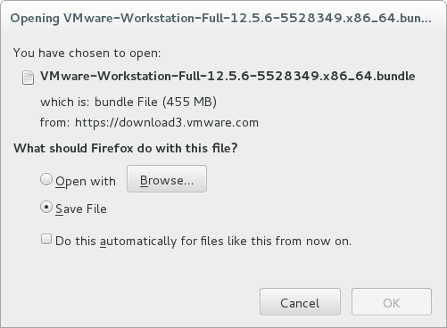

# VMware Workstation

Andrés Hernández

Universidad Nacional Autónoma de México

Facultad de Ciencias

Verano 2017

--------

## Objetivo del curso

+ El alumno conocerá el sistema de virtualización VMware Workstation y aprenderá como instalar el *software* en GNU/Linux.

+ También aprenderá a manejar, importar y exportar máquinas virtuales, así como convertir un equipo existente a una máquina virtual compatible con los productos de VMware.

--------------------------------------------------------------------------------

## Temario (1)

1. Introducción a los sistemas de virtualización

    a. Hipervisores
    b. Máquinas virtuales
    c. Virtualización de aplicaciones
    d. Contenedores
    e. Virtualización anidada

--------

## Temario (2)

2. Introducción a VMware Workstation

    a. Diferencias entre VMware Workstation y otros productos de VMware
    b. Requerimientos de *hardware* y *software* en el *host*
    c. Sistemas operativos soportados en máquinas virtuales
    d. Dispositivos de *hardware* presentados a las máquinas virtuales

--------

## Temario (3)

3. Instalación de VMware Workstation

    a. Descarga del *software* del sitio My VMware
    b. Instalación del *software* en GNU/Linux
    c. Obtención e instalación de la licencia de prueba
    d. Verificación de la correcta instalación del *software* en el equipo

--------

## Temario (4)

4. Creación de máquinas virtuales

    a. Crear una nueva máquina virtual
    b. Editar las propiedades de la máquina virtual
    c. Clonar una máquina virtual
    d. Borrar una máquina virtual
    e. Iniciar y detener una máquina virtual
    f. Modos de pantalla completa

--------

## Temario (5)

5. VMware tools

    a. Instalación de VMware tools en la máquina virtual
    b. Actualización de VMware tools en la máquina virtual
    c. Compartir el portapapeles para copiar y pegar
    d. Compartir archivos utilizando drag-and-drop
    e. Compartir carpetas entre el anfitrión y la máquina virtual
    f. Compartir la impresora entre el anfitrión y la máquina virtual
    g. Conectar dispositivos USB a la máquina virtual

--------

## Temario (6)

6. Administración de máquinas virtuales

    a. Importar y exportar máquinas virtuales
    b. Administración de snapshots
    c. Configuración de acceso remoto
    d. Cambiar la versión de vHardware de la máquina virtual

--------

## Temario (7)

7. Configuración de las conexiones de red

    a. Tipos de conexiones de red
    b. Interfaces de red
    c. Virtual Network Editor

--------

## Temario (8)

8. Convertir un equipo existente en una máquina virtual de VMware

    a. Requisitos de *software* y *hardware*
    b. Descarga del *software* del sitio My VMware
    c. Instalación de VMware vCenter Converter Standalone
    d. Seleccionar origen y destino para la conversión
    e. Verificar vHardware antes de iniciar la máquina virtual

--------------------------------------------------------------------------------

## 1. Introducción a los sistemas de virtualización

--------

### a. Hipervisores

Un *hipervisor* o *monitor de máquinas virtuales* (VMM) es un programa que ejecuta y administra los recursos para las *máquinas virtuales* que corren dentro del __servidor físico__ (*host*)

Existen dos tipos de *hipervisores* que se diferencían de acuerdo al contexto donde se ejecutan:

+ Tipo 1 - *Bare-Metal*
+ Tipo 2 - *Hosted*

--------

#### Tipo 1 - *Bare-Metal hypervisor*

+ Este tipo de *hipervisores* se ejecuta diréctamente sobre el *hardware* del __equipo físico__ (ring 0)
+ Utilizado en servidores
+ Como el *hipervisor* controla el *hardware* el rendimiento es mejor, pero el sistema únicamente se puede dedicar a correr máquinas virtuales
+ Implementa sus propias técnicas para el manejo de recursos (*scheduling*, *interrupts*, *DMA*, *drivers*, etc.)
+ Esta tecnología no es nueva, fue introducida por IBM en los 60's

--------

#### Tipo 2 - *Hosted hypervisor*

+ Este tipo de *hipervisores* se ejecuta sobre un sistema operativo instalado en el equipo (GNU/Linux, MacOS X, FreeBSD, Solaris, Windows, etc.)
+ Utilizado en *workstations*, equipos de escritorio y portátiles (*commodity hardware*)
+ Se ejecuta como una aplicación más en el sistema operativo (ring 3) y depende de los recursos que se asignen (CPU, memoria, acceso a disco y red, etc.)
+ El rendimiento es más lento, pero no es necesario dedicar el equipo únicamente a correr máquinas virtuales
+ Se pueden ejecutar varios *hipervisores* de tipo 2 al mismo tiempo en un equipo (ej. VirtualBox y VMware WorkStation o VMware Fusion)

--------

#### Ejemplos de *software*

| *Vendor*	| *bare-metal*			| *hosted* |
|:-------------:|:-----------------------------:|:--------:|
| Red Hat	| KVM				| KVM |
| FreeBSD	| `bhyve`			| `bhyve` |
| Citrix	| Xen				| - |
| Citrix	| XenServer			| - |
| Oracle	| VM Server			| VirtualBox |
| VMware	| ESX/ESXi <br/> vSphere	| Workstation / Fusion <br/> Player / Server |
| Parallels	| -				| Workstation / Desktop |
| Microsoft	| Hyper-V <br/> Client Hyper-V	| VirtualPC |
| *third-party*	| 				| `qemu` / `bochs` |

--------

#### Extensiones de virtualización

La mayoría del *software* de virtualización requiere que el CPU cuente con características especiales para poder realizar la traducción de direcciones (*IO-MMU virtualization*)

+ [`lm`] Procesador con arquitectura de 64 bits
+ Extensiones de virtualización

    + [`svm`] AMD-V _Pacifica_ Athlon 64 FX Dual Core
    * [`vmx`] Intel VT-X _Vanderpool_ Core 2 Duo

* SLAT - *Second Level Address Translation*

    * [`npt`] AMD-RVi AMD Phenom II X6 / Opteron _Barcelona_
    * [`ept`] Intel VT-d _Nehalem_ Core 2 Quad / Xeon E5

--------

##### Otras extensiones de virtualización

* *Interrupt virtualization*

    * AMD-AVIC _Carrizo_
    * Intel APICv _Ivy Bridge_

* *Network virtualization*

    * Intel VT-c *Virtualization Technology for Connectivity*

* SR-IOV - *PCI-SIG Single Root I/O Virtualization*

* *GPU Virtualization*

    * Intel Iris Pro: GVT-d, GVT-g y GVT-s

--------

### b. Máquinas virtuales

+ Son _instancias_ de sistemas operativos que se ejecutan dentro de un *hipervisor*
+ Tienen sus propios recursos asignados (vCPU, RAM, disco duro, etc.)
+ Al ejecutarse se abre una ventana que simula ser el monitor del equipo y se pueden utilizar el teclado y *mouse* para interactuar con el equipo
+ El *hipervisor* presenta una serie de dispositivos virtualizados que puede utilizar la _máquina virtual_ (*vHardware*)
+ El sistema operativo se instala desde un disco o se importa desde una imágen
+ Puede acceder diréctamente a la red (bridge) o simular que está detrás de un NAT

--------

### c. Virtualización de aplicaciones

+ Permite ejecutar una aplicación sin necesidad de instalarla en el sistema
+ La aplicación corre sobre un entorno que comprende los recursos del sistema mas los recursos simulados que provienen de la capa intermedia de _virtualización_
+ Comúnmente estas aplicaciones se distribuyen como un único archivo ejecutable
+ La capa de _virtualización_ intercepta las llamadas al disco para evitar escribir en el sistema _real_
+ Ejemplos de *software* para _virtualización de aplicaciones_:

    * VMware ThinApp
    * Citrix XenApp
    * Microsoft App-V

--------

### d. Contenedores

+ También conocidos como "jaulas con esteroides", virtualizan todo el sistema operativo excepto el kernel
+ Son más ligeros que las máquinas virtuales porque comparten todos los recursos del sistema operativo
+ Dependiendo la tecnología utilizada, las aplicaciones de los contenedores se ejecutan _lado a lado_ con el sistema operativo _real_
+ Ejemplos de *software* para contenedores:

    * OpenVZ
    * LXC
    * Virtuozzo
    * Solaris Zones and Containers
    * Docker

--------

### e. Virtualización anidada (VT-in-VT)

+ Permite ejecutar un hypervisor dentro de otro
+ Necesita que el CPU cumpla con varios requisitos

    * Arquitectura de 64 bits (x86\_64 / amd64)
    * Tener extensiones de virtualización
    * Implementar algún mecanismo de SLAT (*Second Level Address Translation*)

+ Ejemplos de *software* que soportan virtualización anidada:

    * KVM
    * Xen 4.4+
    * Citrix XenServer
    * Oracle VM Server
    * VMware ESXi / vSphere / Workstation / Fusion
    * Microsoft Hyper-V *

--------------------------------------------------------------------------------

## 2. Introducción a VMware Workstation

--------

### a. Diferencias entre VMware Workstation y otros productos de VMware

| Característica	| **VMware Player**	| **VMware Workstation**	| **VMware Fusion**	| **VMware ESXi/vSphere**	|
|:---------------------:|:---------------------:|:-----------------------------:|:---------------------:|:-----------------------------:|
| **Segmento**		| Uso básico		| Uso profesional		| Uso profesional	| Uso en servidores	|
| **Tipo**		| Tipo 2: *Hosted*	| Tipo 2: *Hosted*		| Tipo 2: *Hosted*	| Tipo 1: *Bare-Metal*	|
| **Licencia**		| Gratuita		| ＄＄				| ＄＄			| ＄＄＄＄＄ *		|
| **Sistema Operativo**	| Linux, Windows, <br/> MacOS X | Linux, Windows	| MacOS X		| Nativo		|
| **MV simultaneas**	| 1			| Muchas			| Muchas		| ∞ MUCHAS		|
| **Snapshots**		| ✘			| ✔				| ✔			| ✔			|
| **vNetwork Editor**	| ✘			| ✔				| ✔			| ✔			|
| **Conexión a ESXi/vSphere**	| ✘		| ✔				| ✔			| ✔			|
| **CLI**		| ✘			| ✔ (`vmrun`, VIX)		| ✔			| ✔ (VIX, `esxcli`, PowerCLI)	|

--------

### b. Requerimientos de *hardware* y *software* en el *host*

De acuerdo a la documentación de VMware los requerimientos del sistema para Workstation Pro 12 son:

| Elemento | Descripción |
|:--------:|:-----------:|
| Procesador	| Arquitectura de 64 bits con extensiones de virtualización	|
| Sistema operativo	| GNU/Linux de 64 bits	|
| Memoria RAM	| Mínimo: 1 GB, Recomendado: 2 GB |
| Disco Duro	| Mínimo 1 GB por cada máquina virtual <br/> Recomendado: 10 GB por máquina virtual |
| Soporte para *Aero*	| 3 GB de RAM y GPU nVidia, ATI o superior |
| Conexión a red	| Red cableada o inalámbrica	|
| Audio del equipo	| Soporte ALSA instalado en el sistema operativo	|

--------

### c. Sistemas operativos soportados en máquinas virtuales

| Sistema Operativo | Versiones |
|:-----------------:|:---------:|
| Debian GNU/Linux	| 8 … 4	|
| CentOS GNU/Linux	| 7 … 4	|
| RHEL/Oracle Enterprise Linux	| 7 … 4	|
| Fedora GNU/Linux	| 16 … 24	|
| Red Hat Enterprise Linux	| Atomic, 7 … 2.1	|
| Red Hat Linux	| 9.0 … 6.2	|
| openSUSE GNU/Linux	| 13.x … 10.x	|
| SUSE Linux	| 10 … 7.3	|
| Ubuntu Linux	| 17.04 … 5.04	|
| FreeBSD	| 11 … 4	|
| Mac OS X	| 10.12 … 10.5	|
| Solaris	| 11 … 8	|
| IBM OS/2 Warp	| 4.5.2, 4.0	|
| Windows	| 10, 8.1, 8, 7, Vista, XP, …	|
| Windows Server	| 2016, 2012 (R2), 2008 (R2), 2003, …	|

--------

### d. Dispositivos de *hardware* presentados a las máquinas virtuales

El hipervisor presenta a cada máquina virtual una serie de dispositivos base de hardware:

+ Tarjeta madre de tipo Intel 440BX
+ Chipset NS338 SIO
+ Controlador Avanzado Programable de E/S 82093AA
+ BIOS Phoenix 4.0 Release 6 con VESA BIOS
+ Si el sistema operativo es de 32 bits, detectará un máximo de 3.5 GB de RAM

--------------------------------------------------------------------------------

## 3. Instalación de VMware Workstation

--------

### a. Descarga del *software* del sitio My VMware

+ Abrir el sitio [My VMware](https://my.vmware.com/ ""), crear una cuenta e iniciar sesión


--------

+ Seleccionar la pestaña de **productos** y dar clic en **gratuitos y de prueba**


--------

+ Ir a la sección de **evaluación de productos**, después a **productos de escritorio** y dar clic en **[Workstation for Linux](http://www.vmware.com/products/workstation-for-linux.html#compare "")**


--------

+ Dar clic en el botón de descarga para [Workstation Player](http://www.vmware.com/go/tryplayerpro-linux-64 "") o [Workstation Pro](http://www.vmware.com/go/tryworkstation-linux-64 ""):


--------

+ Aparecerá la confirmación de descarga del producto seleccionado:




--------

### b. Instalación del *software* en GNU/Linux

+ Instalar las dependencias en el sistema operativo

```sh
# aptitude --assume-yes install build-essential dkms linux-headers-amd64 linux-headers-$(uname -r)+M
```

--------

+ Cambiar los permisos y ejecutar el script `bundle` para instalar el *software*


```sh
# chmod +x *.bundle
# ls -lA
total 597280
-rwxr-xr-x  1 tonejito users 134207691 Jun  1 00:00 VMware-Player-12.5.6-5528349.x86_64.bundle
-rwxr-xr-x  1 tonejito users 477390563 Jun  1 00:00 VMware-Workstation-Full-12.5.6-5528349.x86_64.bundle
```

+ Ejecutar el instalador con permisos administrativos

```sh
# ./VMware-Workstation-Full-12.5.6-5528349.x86_64.bundle
```

--------

+ Aparecerá la ventana que muestra el acuerdo de licencia para **VMware Workstation**, es necesario aceptar los términos para continuar


--------

+ También es necesario aceptar los términos de la licencia de **VMware OVF Tool Component for Linux** para continuar


--------

+ El instalador también pregunta si se desea verificar si existen actualizaciones al iniciar la aplicación


--------

+ El instalador puede enviar estadísticas anónimas a VMware para ayudar al desarrollo de nuevas versiones del *software*


--------

+ Existe una característica de **VMware Workstation** llamda *Workstation Server* que sirve para compartir máquinas virtuales con otros usuarios. El instalador pregunta por la cuenta que será asociada a esta funcionalidad


--------

+ Es necesario especificar una ruta para que *Workstation Server* guarde las máquinas virtuales compartidas


--------

+ *Workstation Server* levanta un puerto en escucha para el acceso web


--------

+ Es posible introducir el código de licencia al momento de la instalación o después


--------

+ Con todos los datos recabados el instalador se encuentra listo para empezar


--------

+ Después de instalar todos los componentes de *software* se muestra el mensaje de éxito


--------

+ Al iniciar la primera vez `vmware` se muestra el cuadro de diálogo que pide compilar los módulos del *kernel*


+ Si no se tienen las dependencias instaladas, se mostrará el siguiente cuadro de diálogo


--------

+ Al instalar los módulos el cuadro de diálogo muestra el progreso


--------

+ También se puede ver el progreso en la terminal

<!--  -->

```sh
$ vmware
...
Stopping VMware services:
   VMware Authentication Daemon                                        done
   VM communication interface socket family                            done
   Virtual machine communication interface                             done
   Virtual machine monitor                                             done
   Blocking file system                                                done
...
Using kernel build system.
/usr/bin/make -C /lib/modules/3.16.0-4-amd64/build/include/.. SUBDIRS=$PWD SRCROOT=$PWD/. \
  MODULEBUILDDIR= modules
make[1]: Entering directory '/usr/src/linux-headers-3.16.0-4-amd64'
...
Starting VMware services:
   Virtual machine monitor                                             done
   Virtual machine communication interface                             done
   VM communication interface socket family                            done
   Blocking file system                                                done
   Virtual ethernet                                                    done
   VMware Authentication Daemon                                        done
   Shared Memory Available                                             done

```

--------

### c. Obtención e instalación de la licencia de prueba

+ Después de instalar los módulos del *kernel* se inicia **VMware Workstation**


--------

+ Es necesario ingresar la clave de licencia para utilizar el producto, o bien se puede introducir una dirección de correo para activar la versión de prueba por 30 días


--------

+ Después de aceptar el cuadro de diálogo anterior, el sistema pide la contraseña de administrador para aplicar los cambios utilizando `licenseTool`


--------

+ Una vez que se ha aplicado la licencia al producto, se muestra el mensaje de bienvenida


--------

+ Al aceptar el mensaje se muestra la interfaz principal de **VMware Workstation**


--------

### d. Verificación de la correcta instalación del *software* en el equipo

+ Para verificar que el producto esté instalado correctamente hay que comprobar la versión del *software*


--------

+ Es recomendable revisar si hay actualizaciones antes de utilizar el programa


--------

+ Desde línea de comandos se puede verificar el estado de los servicios de VMware

```sh
# systemctl list-units | grep -i VMware
vmware.service                       loaded active running    LSB: This service starts and stops VMware services
vmware-workstation-server.service    loaded active running    LSB: This services starts and stops the Workstation as a Server daemon.
vmware-USBArbitrator.service         loaded active running    LSB: This services starts and stops the USB Arbitrator.
```

--------

+ Para listar el estado de cada servicio utilizar `systemctl status <servicio>`

```sh
# systemctl status vmware.service

# systemctl status vmware-workstation-server.service

# systemctl status vmware-USBArbitrator.service
```

--------

+ Verificar los puertos en escucha con `netstat`

```sh
# netstat -ntulp | grep -i VMware
tcp     0    0  0.0.0.0:443         0.0.0.0:*        LISTEN     1024/vmware-hostd
tcp     0    0  0.0.0.0:902         0.0.0.0:*        LISTEN     2048/vmware-authdla
tcp     0    0  127.0.0.1:8307      0.0.0.0:*        LISTEN     1024/vmware-hostd
tcp6    0    0  :::443              :::*             LISTEN     1024/vmware-hostd
tcp6    0    0  :::902              :::*             LISTEN     2048/vmware-authdla
tcp6    0    0  ::1:8307            :::*             LISTEN     1024/vmware-hostd
```

--------

+ Se puede utilizar un navegador para verificar el puerto asignado a **Workstation Server**
+ Observar el emisor del certificado


<!--


-->

--------

+ Para comprobar que el *software* corra sin problemas, es necesario importar una imagen OVA de prueba

+ Abrir la imagen `photon-custom-hw11-1.0-62c543d.ova` en **VMware Workstation**


--------

+ Se abre un cuadro de diálogo donde se asigna un nombre a la máquina virtual que se va a importar y la ubicación donde se guardará


--------

+ Algunas máquinas tienen una licencia que debe ser aceptada antes de poder utilizarlas


--------

* Una vez importada la máquina virtual, presionar el botón para iniciar la ejecución


--------

+ Aparecerá una pantalla de inicio del sistema operativo (*splashscreen*)


--------

* Una vez que la máquina virtual termine de iniciar, ingresar al equipo, asignar una nueva contraseña y verificar la conectividad de red


--------------------------------------------------------------------------------

## 4. Creación de máquinas virtuales

--------

### a. Crear una nueva máquina virtual

...

--------

### b. Editar las propiedades de la máquina virtual

...

--------

### c. Clonar una máquina virtual

...

--------

### d. Borrar una máquina virtual

...

--------

### e. Iniciar y detener una máquina virtual

...

--------

### f. Modos de pantalla completa

...

--------------------------------------------------------------------------------

## 5. VMware tools

--------

### a. Instalación de VMware tools en la máquina virtual

...

--------

### b. Actualización de VMware tools en la máquina virtual

...

--------

### c. Compartir el portapapeles para copiar y pegar

...

--------

### d. Compartir archivos utilizando drag-and-drop

...

--------

### e. Compartir carpetas entre el anfitrión y la máquina virtual

...

--------

### f. Compartir la impresora entre el anfitrión y la máquina virtual

...

--------

### g. Conectar dispositivos USB a la máquina virtual

...

--------------------------------------------------------------------------------

## 6. Administración de máquinas virtuales

--------

### a. Importar y exportar máquinas virtuales

...

--------

### b. Administración de snapshots

...

--------

### c. Configuración de acceso remoto

...

--------

### d. Cambiar la versión de vHardware de la máquina virtual

...

--------------------------------------------------------------------------------

## 7. Configuración de las conexiones de red

--------

### a. Tipos de conexiones de red

...

--------

### b. Interfaces de red

...

--------

### c. Virtual Network Editor

...

--------------------------------------------------------------------------------

## 8. Convertir un equipo existente en una máquina virtual de VMware

...

--------


### a. Requisitos de *software* y *hardware*

...

--------

### b. Descarga del *software* del sitio My VMware

...

--------

### c. Instalación de VMware vCenter Converter Standalone

...

--------

### d. Seleccionar origen y destino para la conversión

...

--------

### e. Verificar vHardware antes de iniciar la máquina virtual

...

--------------------------------------------------------------------------------

# Gracias

--------

## Referencias

+ [VMware Virtualization for Desktop, Server, Application, Public and Hybrid Clouds](https://www.vmware.com/ "")
+ [My VMware - Simplified Management for Products and Support](https://my.vmware.com/ "")
+ [VMware Documentation Portal](https://www.vmware.com/support/pubs/ "")
+ [VMware - E6998 - Virtual Machines Lecture 1 - What is Virtualization? - Scott Devine](https://labs.vmware.com/download/105/ "")
+ [nixCraft - Linux: Find Out If CPU Support Intel VT and AMD-V Virtualization Support](https://www.cyberciti.biz/faq/linux-xen-vmware-kvm-intel-vt-amd-v-support/ "")
+ [VMware Workstation Pro Documentation](https://www.vmware.com/support/pubs/ws_pubs.html "")
+ [VMware Workstation Comparison](http://www.vmware.com/products/workstation.html#compare "")
+ [Guest Operating System Installation Guide](http://partnerweb.vmware.com/GOSIG/home.html "")
+ [VMware Compatibility Guide](http://www.vmware.com/resources/compatibility/search.php?deviceCategory=software "")
+ [Running Photon OS on vSphere](https://github.com/vmware/photon/wiki/Running-Photon-OS-on-vSphere "")
